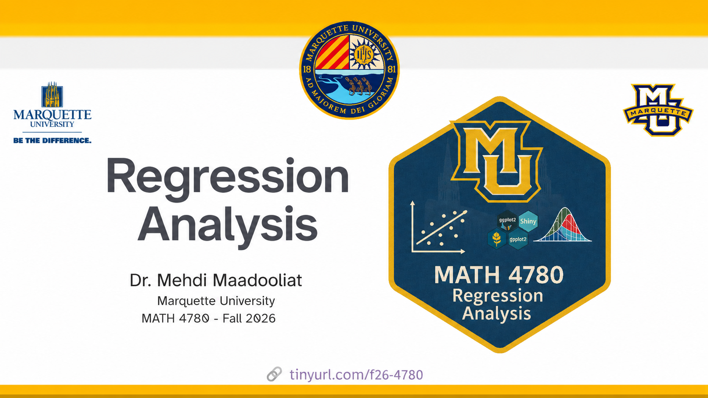

This is the homepage for MATH 4780 (MSSC 5780) - Regression Analysis by [Dr. Mehdi Maadooliat](www.mssc.mu.edu/~mehdi) in Fall 2026 at Marquette University. All course materials will be posted on this site.

You can find the course syllabus [here](/course-syllabus.html) and the course schedule [here](/).

## Class meetings

| Meeting      | Location        | Time                                      |
|--------------|-----------------|-------------------------------------------|
| Lecture      | Cudahy Hall 131 | Tue & Thur 12:30 pm - 1:45 pm             |
| Office Hours | Cudahy Hall 351 | Tu 1:45pm - 3:15pm & Th 10:45am - 12:15pm |

