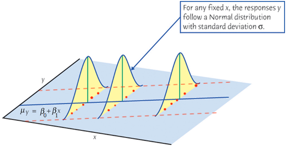

#  {visibility="hidden"}

\def\bx{\mathbf{x}}
\def\bg{\mathbf{g}}
\def\bw{\mathbf{w}}
\def\balpha{\boldsymbol \alpha}
\def\bbeta{\boldsymbol \beta}
\def\beps{\boldsymbol \epsilon}
\def\bX{\mathbf{X}}
\def\by{\mathbf{y}}
\def\bH{\mathbf{H}}
\def\bI{\mathbf{I}}
\def\bS{\mathbf{S}}
\def\bW{\mathbf{W}}
\def\T{\text{T}}
\def\cov{\mathrm{Cov}}
\def\cor{\mathrm{Corr}}
\def\var{\mathrm{Var}}
\def\E{\mathrm{E}}
\def\bmu{\boldsymbol \mu}
\DeclareMathOperator*{\argmin}{arg\,min}
\def\Trace{\text{Trace}}


```{r}
#| label: setup
#| include: false
#| eval: true
library(countdown)
library(emo)
library(knitr)
library(gt)
library(gtExtras)
library(ggplot2)
library(tidyverse)
library(tidymodels)
library(MASS)
library(car)
knitr::opts_chunk$set(
    fig.asp = 0.6,
    fig.align = "center",
    out.width = "70%",
    fig.retina = 10,
    fig.path = "./images/08-diag-normality/",
    message = FALSE,
    global.par = TRUE
)
options(
  htmltools.dir.version = FALSE,
  dplyr.print_min = 6, 
  dplyr.print_max = 6,
  tibble.width = 80,
  width = 80,
  digits = 2
  )
hook_output <- knitr::knit_hooks$get("output")
knitr::knit_hooks$set(output = function(x, options) {
  lines <- options$output.lines
  if (is.null(lines)) {
    return(hook_output(x, options))  # pass to default hook
  }
  x <- unlist(strsplit(x, "\n"))
  more <- "..."
  if (length(lines)==1) {        # first n lines
    if (length(x) > lines) {
      # truncate the output, but add ....
      x <- c(head(x, lines), more)
    }
  } else {
    x <- c(more, x[lines], more)
  }
  # paste these lines together
  x <- paste(c(x, ""), collapse = "\n")
  hook_output(x, options)
})
par(cex = 4)
```


```{r}
#| echo: false
delivery <- read.csv(file = "./data/data-ex-3-1.csv",
                     header = TRUE)
delivery_data <- delivery[, -1]
colnames(delivery_data) <- c("time", "cases", "distance")
delivery_lm <- lm(time ~ cases + distance, data = delivery_data)
summ_delivery <- summary(delivery_lm)
```


## Assumptions of Linear Regression
$Y_i= \beta_0 + \beta_1X_{i1} + \beta_2X_{i2} + \dots + \beta_kX_{ik} + \epsilon_i$

:::: {.columns}
::: {.column width="50%"}
- $E(Y \mid X)$ and $X$ are linearly related.
- $\small E(\epsilon_i) = 0$
- $\small \var(\epsilon_i) = \sigma^2$
- $\small \cov(\epsilon_i, \epsilon_j) = 0$ for all $i \ne j$.
- $\small \epsilon_i \stackrel{iid}{\sim} N(0, \sigma^2)$ (for statistical inference)
:::


::: {.column width="50%"}
```{r}
#| out-width: 100%

```
:::
::::


::: notes
<!-- - How's your exam? -->
<!-- - We finished the discussion of SLR and MLR. Remember that our regression models are based on some assumptions. In fact these assumptions are quite restricted. -->
- Bridge from last lecture: we looked at *individual* unusual points (outliers, leverage, influence). Today we look at the *overall distribution* of the errors, and the R-student residuals from last time are our main tool again.
- It's not that uncommon to see violations of assumptions.
- Today, we are going to learn how to check whether those assumptions are satisfied, and, over the next lectures, how to deal with violations.
- Pacing: assumptions & overview ~5 | why normality matters ~5 | detecting (QQ, density) ~10 | correcting: ladder of powers & Box-Cox ~15 | CIA R Labs (incl. recheck) ~10 | other issues & interpretation ~5 → about 50 min; the remaining time can start 09 (which continues with the CIA data).
:::

. . .

::: alert
- If the assumptions are violated, a different sample could lead to a different conclusion!
- $R^2$ tells us how well the model fits the data, but says nothing about whether the model is correct.
- All the inferences are based on the assumption that the model is correct.
:::


# Model Adequacy Checking and Correction

<h2> <span style="color:red"> Non-normality</span></h2>
<h2> Non-constant Error Variance </h2>
<h2> Non-linearity and Lack of Fit </h2>

::: notes

- This week we are going to learn some methods to correct model inadequacy.
- We can either transform our data, or use a more general method, called Generalized Least Squares or Weighted Least Squares.
- $\epsilon_i \stackrel{iid}{\sim} N(0, \sigma^2)$: **mean 0**, **constant variance**, **normally distributed**, and **uncorrelated**.
- $E(\epsilon_i) =0$ implies the function form of the model (**linearity**) is correct.

:::

## Non-normality
- The central limit theorem assures the validity of inferences based on the least-squares (LS) coefficients in all but small samples.

. . .

Without normality, 

- **Heavier tailed** errors:
  + LS is still BLUE (best among *linear* unbiased estimators), but robust (nonlinear) estimators can have **much smaller** variance.
  + give rise to **outliers**.

::: notes
- Gauss-Markov does not require normality. With normal errors, LS is best among *all* unbiased estimators; without normality, only among *linear* ones.
:::

. . .

- **Skewed** errors:
  + tend to generate outliers in the direction of the skew.
  + the conditional mean of $y$ given $x$ is not a good measure of center of a highly skewed distribution.

. . .

- **Multimodal** errors:
  + suggest the omission of one or more categorical regressors.
  
  
::: notes
- $\epsilon_i \stackrel{iid}{\sim} N(0, \sigma^2)$: **mean 0**, **constant variance**, **normally distributed**, and **uncorrelated**.
- The form of the model (**linearity**) and the specification of the predictors are correct. 
- Check model adequacy by residual plots and lack-of-fit tests.
- Methods for building models when some of the assumptions are violated.
  + data transformation
  + generalized least squares (GLS) and weighted least squares (WLS)
  
:::


## Detecting Nonnormality
<!-- - Under normality, the R-student residuals $t_i$s have mean *zero* and *equal* variances. -->

- The R-student residuals $t_i \sim t_{n-p-1}$ if the model assumptions are correct.

- Compare the distribution of the $t_i$s to $t_{n-p-1}$ in QQ plot.

::: notes
- One way to address the assumption of normality is to compare the distribution of the R-student residuals to $t_{n-p-1}$ in QQ plot.
:::

. . .


```{r}
#| fig-asp: 0.2
#| out-width: 100%
set.seed(4780)
par(mfrow = c(1, 5))
par(mar = c(2, 2, 1, 1), mgp = c(1, 0.5, 0))
normal_sample <- rnorm(1000)
right_skewed_sample <- rgamma(1000, 2, 1 / 2)
left_skewed_sample <- rbeta(1000, 8, 2)
heavy_tail_sample <- rt(1000, df = 2)
light_tail_sample <- runif(1000)
qqnorm(normal_sample, pch = 16, main = "Normal", cex.lab = 0.6, cex.axis = 0.6)
qqline(normal_sample, col = 2, lwd = 2)
qqnorm(right_skewed_sample, pch = 16, main = "Right-skewed", cex.lab = 0.6, cex.axis = 0.6)
qqline(right_skewed_sample, col = 2, lwd = 2)
qqnorm(left_skewed_sample, pch = 16, main = "Left-skewed", cex.lab = 0.6, cex.axis = 0.6)
qqline(left_skewed_sample, col = 2, lwd = 2)
qqnorm(heavy_tail_sample, pch = 16, main = "Heavy-tailed", cex.lab = 0.6, cex.axis = 0.6)
qqline(heavy_tail_sample, col = 2, lwd = 2)
qqnorm(light_tail_sample, pch = 16, main = "Light-tailed", cex.lab = 0.6, cex.axis = 0.6)
qqline(light_tail_sample, col = 2, lwd = 2)
```

::: notes
How to read a QQ plot (sample quantiles on the vertical axis):
- Right-skewed: points curve *above* the line at both ends (convex, "U" shape).
- Left-skewed: points curve *below* the line at both ends (concave).
- Heavy-tailed: low end below the line, high end above it (stretched "S").
- Light-tailed: the opposite: ends flatten toward the line's interior.
:::


## QQ Plot of R-Student Residuals vs. $t_{n-p-1}$

```{r}
#| echo: !expr c(-1)
#| results: hide
#| out-width: 58%
par(mar = c(3, 3, 0, 0), mgp = c(2, 0.8, 0), las = 1, mfrow = c(1, 1))
car::qqPlot(delivery_lm, id = TRUE, col.lines = "blue", 
            reps = 1000, ylab = "Ordered R-Student Residuals", pch = 16)
```

. . .

::: question
Is there evidence of non-normality in the delivery time data?
:::

- Apart from point 9 (the outlier we found last lecture), the residuals follow the $t_{21}$ reference line reasonably well.

::: notes
- The `car` package calls the R-student residuals *studentized* residuals.
- Given an `lm` object, `car::qqPlot()` automatically plots the R-student residuals against $t_{n-p-1}$ quantiles, with a pointwise 95% envelope (`reps` = number of bootstrap samples for the envelope).
- `id = TRUE` labels the 2 points with the most extreme residuals (here 9 and 20); `id = FALSE` labels none; a list such as `id = list(n = 3)` gives more control.
- No severe problem in the delivery data other than point 9.
:::

## Density plot of R-Student Residuals

```{r}
#| echo: !expr c(-1)
#| out-width: 58%
par(mar = c(3, 3, 2, 0), mgp = c(2, 0.8, 0), las = 1, mfrow = c(1, 1))
rstud <- rstudent(delivery_lm)
hist(rstud, prob = TRUE, breaks = 10, xlab = "R-Student Residuals", main = "")
lines(density(rstud, adjust = 2), col = 4, lwd = 2)
```

- Roughly symmetric and unimodal, with one isolated point on the right (point 9).
- With $n = 25$, histograms are noisy: don't over-read small bumps.


::: notes
- The QQ plot draws attention to the tail behavior of the R-student residuals but is less effective in visualizing their distribution as a whole.
- Check histogram or smooth density plot of the R-student residuals to get the general shape of the distribution.
- If the density were clearly bimodal, that would suggest a missing categorical regressor.
- Alternative: `car::densityPlot(rstud, adjust = 2, xlab = "R-Student Residuals")`
:::


## Correcting Nonnormality

- A response that is close to normal usually makes the assumption of normal errors more tenable.

- *Heavier tailed* errors:
  + Use robust regression (Chap 15 in LRA)

- *Skewed* errors:
  + Transform response data for symmetry
  
- *Multimodal* errors:
  + Add one or more relevant categorical variables.


::: alert
Goal: after correction, the errors (equivalently, $y$ given the $x$s) should look approximately normal.
:::


## Transformation for Symmetry

**Power transformation: $y \rightarrow y^{\lambda}$**

  + make the distribution of $y$ more normal, *at least more symmetric*.
  + requires $y > 0$.
  + $y \rightarrow \ln(y)$ for $\lambda = 0.$

. . .

**Ladder of powers and roots (Tukey, 1977)**:

- No transformation: $\lambda = 1$
- **Descending**: *spreads out the __small__ values of $y$ relative to the large values*.
    + $\lambda = 1/2$ (square root); $\lambda = 0$ (natural log); $\lambda = -1$ (inverse) 
- **Ascending**: *spreads out the __large__ values relative to the small values*.
    + $\lambda = 2$ (square); $\lambda = 3$ (cube) 

::: notes
- If $\lambda$ is descending from $1$ to $-1$, the transformation increasingly spreads out the small values of $y$ relative to the large values.
:::


. . .

::: alert
The order of $y$ is *reversed* if $\lambda < 0$ is used for power transformation.
:::


## Correcting Skewness by Power Transformation
```{r}
#| echo: false
#| include: false
## Descending the ladder of powers to correct a right skew
y <- c(1, 10, 100, 1000) ## gap between 2 numbers: 9, 90, 900
log10(y) ## gap between 2 numbers becomes all 1, meaning symmetry

# Ascending the ladder of powers to correct a left skew
z <- c(1, 1.414, 1.732, 2) ## gap between 2 numbers: .414, .318, .268
z ^ 2 ## gap between 2 numbers becomes all 1, meaning symmetry
```

```{r}
#| out-width: 78%
#| fig-asp: 0.3
set.seed(4780)
par(mar = c(3, 3, 2, 0), mgp = c(2, 0.8, 0), las = 1, mfrow = c(1, 2))
r_skewed <- rgamma(10000, 3, 1)
hist(r_skewed, probability = TRUE, main = expression(paste("right-skewed ", y)),
     ylab = "", xlab = "")
# arrows(14, 0.05, 6, 0.05, lwd = 2, col = 2)
hist(sqrt(r_skewed), probability = TRUE, xlab = "", ylab = "",
     main = expression(paste(sqrt(y), " ", (lambda == 1/2))))
# arrows(14, 0.01, 6, 0.01, lwd = 2, col = 2)
```


```{r}
#| out-width: 78%
#| fig-asp: 0.3
par(mar = c(3, 3, 2, 0), mgp = c(2, 0.8, 0), las = 1, mfrow = c(1, 2))
l_skewed <- rbeta(10000, 6, 3)
hist(l_skewed, probability = TRUE, main = expression(paste("left-skewed ", y)),
     ylab = "", xlab = "", col = 4)
# arrows(14, 0.05, 6, 0.05, lwd = 2, col = 2)
hist(l_skewed^2, probability = TRUE, xlab = "", ylab = "", col = 4,
     main = expression(paste(y ^ 2, " ", (lambda == 2))))
# arrows(14, 0.01, 6, 0.01, lwd = 2, col = 2)
```

::: notes
- Quick intuition: $y = 1, 10, 100, 1000$ has gaps $9, 90, 900$ (right skew); $\log_{10} y = 0, 1, 2, 3$ has equal gaps.
- Likewise $y = 1, 1.414, 1.732, 2$ has shrinking gaps (left skew); $y^2 = 1, 2, 3, 4$ has equal gaps.
:::


## Box-Cox Transformation on $y$


  
:::: {.columns}

::: {.column width="35%"}

A modified power transformation by [Box and Cox (1964)](https://www.nuffield.ox.ac.uk/users/cox/cox72.pdf):

$$y^{(\lambda)} = \begin{cases}
    \frac{y^{\lambda}-1}{\lambda},       & \quad \lambda \ne 0\\
    \ln y,  & \quad \lambda = 0
  \end{cases}$$
  
::: alert

- For all $\lambda$, $y^{(\lambda)} = 0$ and its slope is $1$ at $y = 1$ (all curves touch at $(1, 0)$).
- The order of the transformed data $y^{(\lambda)}$ is the same as that of $y$, even for $\lambda < 0.$

:::
:::
  


::: {.column width="65%"}

```{r}
#| out-width: 100%
n <- 500
x <- seq(0.1, 3, length = n)
x1 <- bcPower(x, 1)
x0.5 <- bcPower(x, 0.5)
x0 <- bcPower(x, 0)
xm0.5 <- bcPower(x, -0.5)
xm1 <- bcPower(x, -1)
x2 <- bcPower(x, 2)
x3 <- bcPower(x, 3)
xlim <- range(c(x1, x0.5, x0, xm0.5, xm1, x2, x3))
par(mar = c(2, 3, 3, 2), mgp = c(2, 0.8, 0), las = 1, mfrow = c(1, 1))
plot(range(x) + c(-0.6, 0.5), c(-5, 10), type = "n", xlab = "", ylab = "", 
     las = 1)
usr <- par("usr")
text(usr[2], usr[3] - 1, label = "y", xpd = TRUE)
# text(usr[1] - 0.2, usr[4] + 0.75, label = expression(t[BC](x, lambda)), 
#      xpd = TRUE)
text(usr[1] - 0.2, usr[4] + 0.75, label = expression(y^(lambda)), 
     xpd = TRUE)
lines(x, x1, lwd = 2)
text(x[n] + 0.0625, x1[n], labels = expression(lambda == 1), adj = c(0, 0.2), cex = 2)
lines(x, x2, lwd = 2, col = 2)
text(x[n] + 0.0625, x2[n], labels = expression(lambda == 2), adj = c(0, 0.2), 
     col = 2, cex = 2)
lines(x, x3, lwd = 2, col = 3)
text(x[n] + 0.0625, x3[n], labels = expression(lambda == 3), adj = c(0, 0.2),
     col = 3, cex = 2)
lines(x, x0.5, lwd = 2, col = 4)
text(x[1] - 0.025, x0.5[1], labels = expression(lambda == 0.5), adj = c(1, 0.3),
     col = 4, cex = 2)
lines(x, x0, lwd = 2, col = 5)
text(x[1] - 0.025, x0[1], labels = expression(lambda == 0), adj = c(1, 0.3),
     col = 5, cex = 2)
lines(x, xm0.5, lwd = 2, col = 6)
text(x[1] - 0.025, xm0.5[1], labels = expression(lambda == -0.5), 
     adj = c(1, 0.3), col = 6, cex = 2)
lines(x = c(1, 1), y = c(usr[3], 0), lty = 2)
lines(x = c(usr[1], 1), y = c(0, 0), lty = 2)
```

:::
::::


::: notes
- The derivative w.r.t. $y$ of $y^{(\lambda)}$ at $y = 1$ is 1 for any $\lambda$; that is why the curves are tangent at $(1, 0)$ in the plot.
- $(y^\lambda - 1)/\lambda \to \ln y$ as $\lambda \to 0$, so the family is continuous in $\lambda$.
- Dividing by $\lambda$ keeps the order of the data even when $\lambda < 0$, unlike plain $y^\lambda$.
:::


## Box-Cox Transformation on $y$: Choose $\lambda$ Analytically

- The model to be fit is 
$$y_i^{(\lambda)} = \beta_0 + \beta_1x_{i1}+ \cdots + \beta_kx_{ik} + \epsilon_i^*$$
- Choose $\lambda$ so that the transformed errors $\epsilon_i^*$ look as nearly normally distributed as possible.

. . .

- In practice, $\hat{\lambda}$ is the **maximum likelihood** estimate, assuming $\epsilon_i^* \stackrel{iid}{\sim} N(0, \sigma^2)$.
- Report a confidence interval for $\lambda$ and use a convenient value inside (or near) it, e.g., $1, 0.5, 0, -0.5, -1$.

::: notes
- LRA uses the scaled version $y^{(\lambda)} = (y^\lambda - 1)/(\lambda \dot{y}^{\lambda - 1})$, where $\dot{y}$ is the geometric mean of $y$, so that $SS_{Res}(\lambda)$ values are comparable across $\lambda$; minimizing $SS_{Res}(\lambda)$ is then equivalent to maximizing the likelihood.
:::


## [R Lab]{.pink} [CIA World Factbook Data](https://www.john-fox.ca/RegressionDiagnostics/index.html)

```{r}
CIA <- read.table("./data/CIA.txt", header = TRUE)
```

:::: {.columns}

::: {.column width="55%"}
```{r}
#| class-output: my_class600
head(CIA, n = 12)
```
:::

::: {.column width="45%"}
- `gdp`: GDP per capita in thousands of U.S. dollars
- `infant`: Infant mortality rate per 1000 live births
- `gini`: Gini coefficient for the distribution of family income
- `health`: Health expenditures as a percentage of GDP
:::
::::


## [R Lab]{.pink} R-Student Residuals

- See how `gdp`, `health` and `gini` affect `infant`.
- R-Student residuals are right-skewed, suggesting transforming the response, infant mortality, down the ladder of powers.

```{r}
#| fig-asp: 0.5
#| out-width: 56%
#| echo: !expr c(-1)
par(mar = c(3, 3, 2, 0), mgp = c(2, 0.8, 0), las = 1, mfrow = c(1, 2))
ciafit <- lm(infant ~ gdp + health + gini, data = CIA)
r_stud <- rstudent(ciafit)
car::qqPlot(ciafit, id = FALSE)
car::densityPlot(r_stud)
```


## [R Lab]{.pink} Box-Cox Transformation

```{r}
#| echo: !expr c(-1)
#| label: boxcox
#| code-fold: true
#| out-width: 70%
par(mar = c(3, 3, 0, 0), mgp = c(2, 0.8, 0), las = 1, mfrow = c(1, 1))
mat <- matrix(r_stud)
for (lam in c(0.5, 0, -0.5, -1)) {
    refit <- update(
        ciafit, car::bcPower(infant, lam) ~ .
        )
    mat <- cbind(rstudent(refit), mat)
}
colnames(mat) <- c(-1, -0.5, "log", 0.5, 1)
boxplot(
    mat, 
    xlab = expression("Powers," ~ lambda),
    ylab = expression(
        "R-Student Residuals for " 
        ~ Infant ^ (lambda))
    )
```

- The residuals look most symmetric somewhere between $\lambda = 0$ (log) and $\lambda = -0.5$.


## [R Lab]{.pink} Choose $\lambda$ Analytically
```{r}
#| echo: true
#| class-output: my_class600
summary(car::powerTransform(ciafit, family = "bcPower"))
```

- $\hat{\lambda} = -0.22$, and the $95\%$ CI for $\lambda$ is $[-0.37, -0.07]$.
- $\lambda = 1$ not in the interval, providing support for transforming response.
- $\lambda = 0$ (log transformation) is slightly outside the interval (LR test $p < 0.01$).
- Still, the log is often preferred for its simple interpretation; let's refit and recheck.


::: notes
- `car::powerTransform()` estimates $\lambda$ by maximum likelihood; the interval shown is a Wald interval.
- The two LR tests in the output test $\lambda = 0$ (log) and $\lambda = 1$ (no transformation).
- `MASS::boxcox(ciafit)` plots the profile log-likelihood if you want a picture of the same thing.
:::

## [R Lab]{.pink} Refit on the Log Scale and Recheck

```{r}
#| fig-asp: 0.5
#| out-width: 56%
#| echo: !expr c(-1)
par(mar = c(3, 3, 2, 0), mgp = c(2, 0.8, 0), las = 1, mfrow = c(1, 2))
logciafit <- lm(log(infant) ~ gdp + health + gini, data = CIA)
car::qqPlot(logciafit, id = list(n = 1))
car::densityPlot(rstudent(logciafit))
```

- Compared to the original fit, the strong right skew is gone.
- One country (Luxembourg) still stands out as an outlier: check it with last lecture's tools.

::: notes
- Always recheck diagnostics after transforming; a transformation can fix one problem and create or reveal another.
- The CIA data come back in the next lecture (nonconstant variance).
:::

## Other Issues
- Apply power transformations to data with zero or negative values by adding a positive constant to the data to make all values positive.
  + $\log(y + 10)$ if all $y > -10$.
  
. . .

- Power transformations are effective when the ratio of the largest to smallest values is sufficiently large (for `infant`, the ratio is about 50).
  + If $y_{max}/y_{min} \approx 1$, power transformations are nearly linear.
  + Increase the ratio by subtracting a constant $0 < c < y_{min}$: $(y_{max} - c)/(y_{min}-c)$

. . .

- If acceptable, choose log transformation for simple interpretation.

```{r}
#| echo: true
logciafit <- lm(log(infant) ~ gdp + health + gini, data = CIA)
coef(logciafit)
```

- Holding `health` and `gini` constant, a one-unit (\$1000) increase in `gdp` multiplies the typical (geometric-mean) infant mortality rate by $\exp(b_{gdp})$ = `r round(exp(coef(logciafit)["gdp"]), 3)`, i.e., about a `r round((1 - exp(coef(logciafit)["gdp"])) * 100, 1)`% decrease.


::: notes
Hawkins and Weisberg (2017)
- For a skewed conditional distribution of $y$, the mean is not a good measure of center.
  + Alternative: model the conditional *median* of the response (quantile regression).
- OLS on the original $y$ estimates the conditional arithmetic mean; OLS on $\log y$ estimates the conditional geometric mean of $y$ (which equals the median if the log-scale errors are symmetric).

:::


## Summary: Checking and Correcting Non-normality

1. Fit the model and compute the R-student residuals `rstudent()`.
2. Compare them to $t_{n-p-1}$ with a QQ plot `car::qqPlot()`; look at the overall shape with a density plot.
3. Heavy tails → robust regression; multimodal → missing categorical regressor; skewed → transform $y$.
4. Choose $\lambda$ with the ladder of powers or Box-Cox `car::powerTransform()`, preferring an interpretable value.
5. Refit and **recheck** the diagnostics.


<!-- ## Other Issues {visibility="hidden"} -->

<!-- - If acceptable, choose log transformation for simple interpratation. -->

<!-- ```{r} -->
<!-- logciafit <- lm(log(infant) ~ gdp + health + gini, data = CIA) -->
<!-- coef(logciafit) -->
<!-- ``` -->

<!-- - All else held constant, for one unit increase of `gdp`, the infant mortality rate is expected to be decreased, on average, by `r round(1 - exp(-0.044), 3) * 100`% because $\exp(-0.044) = 0.957$. -->

<!-- ??? -->
<!-- https://stats.oarc.ucla.edu/other/mult-pkg/faq/general/faqhow-do-i-interpret-a-regression-model-when-some-variables-are-log-transformed/ -->
<!-- https://data.library.virginia.edu/interpreting-log-transformations-in-a-linear-model/ -->
<!-- chrome-extension://efaidnbmnnnibpcajpcglclefindmkaj/https://kenbenoit.net/assets/courses/ME104/logmodels2.pdf -->

<!-- https://medium.com/@kyawsawhtoon/log-transformation-purpose-and-interpretation-9444b4b049c9 -->

<!-- https://sites.google.com/site/curtiskephart/ta/econ113/interpreting-beta -->

<!-- https://stats.stackexchange.com/questions/18480/interpretation-of-log-transformed-predictor-and-or-response -->

<!-- https://zief0002.github.io/book-8252/nonlinearity-log-transforming-the-predictor.html -->

